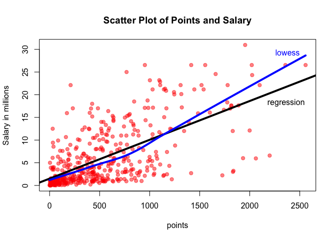
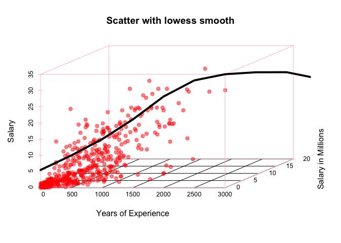
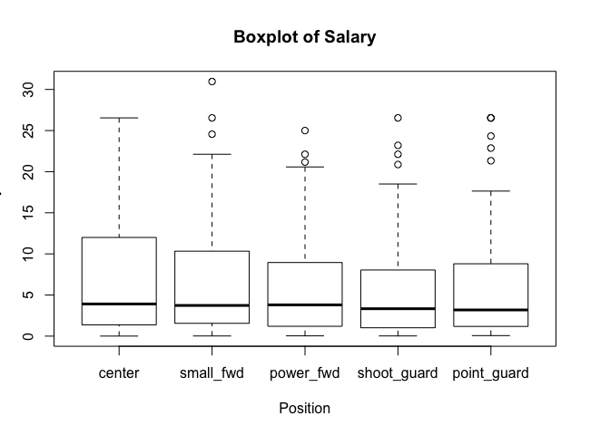
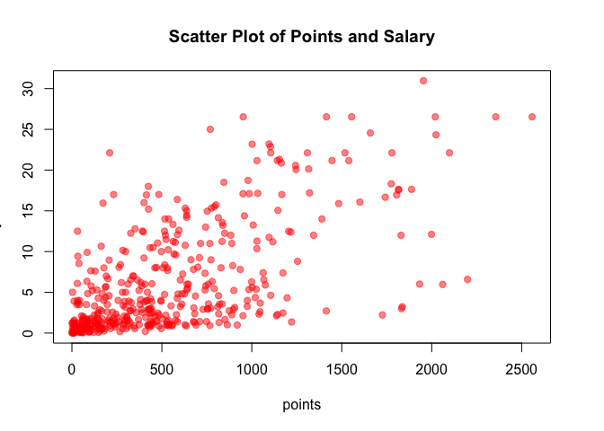

hw01-Romo-Roberto
================

MOOOOARRR VECTORS!!!
====================

``` r
##1: A bit of data preporcessing
newSalary <- salary / 1000000
signif(newSalary, digits = 2)
```

    ##   [1] 27.0000 12.0000  8.3000  1.4000  1.4000  6.6000  6.3000  1.8000
    ##   [9]  4.7000  5.0000  1.2000  3.1000  3.6000  1.9000  8.0000  7.8000
    ##  [17]  0.0180  0.2600  0.2700  0.0051  9.7000 13.0000  1.6000  0.5400
    ##  [25] 21.0000  5.2000 18.0000 31.0000  2.5000 15.0000  1.6000  7.3000
    ##  [33]  1.6000 27.0000 14.0000  0.5400  2.7000 14.0000 12.0000  1.9000
    ##  [41]  0.8700  5.3000  1.2000  6.0000 12.0000  3.7000 22.0000  1.2000
    ##  [49]  1.2000  0.5400 16.0000  5.0000 17.0000 12.0000  7.4000  5.9000
    ##  [57]  0.5400  2.9000  3.4000  1.5000  2.7000 23.0000  8.4000  0.3900
    ##  [65] 16.0000  4.0000  2.5000  4.8000  1.0000 20.0000  0.4200  3.8000
    ##  [73]  2.3000  3.0000 17.0000  5.4000  1.6000 13.0000 15.0000  0.9200
    ##  [81]  9.6000  1.4000 10.0000  1.8000  6.3000  2.6000  2.4000  2.7000
    ##  [89] 10.0000  4.6000  0.6500  8.8000  1.1000  1.8000  4.0000  4.0000
    ##  [97] 11.0000  2.5000 18.0000  1.1000 14.0000  3.5000  1.5000  2.1000
    ## [105]  0.8700  2.1000 23.0000  1.0000  1.6000 18.0000  1.7000  3.2000
    ## [113]  5.8000  0.7500 14.0000 13.0000  2.9000 16.0000 22.0000  4.0000
    ## [121]  5.8000  0.8700  2.6000  1.2000  0.2100  0.5400  5.6000  4.0000
    ## [129]  6.0000  1.0000 22.0000  6.5000  1.6000  7.0000  0.8700  1.7000
    ## [137]  6.0000 11.0000  3.7000  4.6000  0.6500  2.3000 15.0000  3.0000
    ## [145] 17.0000  1.1000  0.1000  0.8700  5.3000  2.7000  6.5000  0.1600
    ## [153] 12.0000  6.3000 12.0000 13.0000 12.0000 21.0000  6.0000  0.5400
    ## [161] 25.0000  0.1400 11.0000 21.0000 17.0000  1.0000  4.3000  3.9000
    ## [169]  6.2000  0.5400  0.5400  2.9000  0.5400  1.4000  1.4000  4.4000
    ## [177] 17.0000  5.0000  7.2000  0.9800  2.6000 17.0000 15.0000  6.5000
    ## [185]  0.0320  3.9000 12.0000  0.0320  0.9500 10.0000  0.0320  2.3000
    ## [193]  9.0000  4.8000  9.4000  4.8000  1.5000  3.0000  1.0000  1.0000
    ## [201]  8.0000  0.0900  0.8700  8.6000  1.3000  6.1000  0.1200 21.0000
    ## [209]  1.6000  1.1000 11.0000  0.9800  3.0000  3.3000  1.8000  2.5000
    ## [217]  1.4000  0.9800  0.7300  9.2000 11.0000  1.2000  1.6000 15.0000
    ## [225]  1.0000  0.9800  1.4000 27.0000  1.2000 17.0000  0.3800  0.5400
    ## [233]  5.8000 12.0000  2.9000  0.5400 10.0000  1.6000  0.5400  1.2000
    ## [241]  2.9000  0.1700  0.8700 18.0000  1.2000 21.0000 14.0000  3.6000
    ## [249] 16.0000 14.0000  0.6800  0.5400  1.3000 12.0000  0.2600 27.0000
    ## [257]  0.5400  7.0000  1.0000  6.0000 19.0000  1.7000  7.8000  0.1500
    ## [265]  1.3000 11.0000 20.0000  1.6000  1.3000 23.0000 21.0000  0.5400
    ## [273]  7.4000 13.0000  2.2000  1.4000  3.5000  1.6000  5.6000 10.0000
    ## [281]  7.0000  3.9000 11.0000  8.0000 16.0000  1.0000  2.2000 11.0000
    ## [289]  0.6000  0.9400  1.4000  2.1000  2.4000  2.3000  6.0000  2.2000
    ## [297]  2.4000  2.5000 17.0000  0.9800  1.2000  4.8000  3.8000  0.2500
    ## [305] 27.0000  0.5400  3.1000  9.0000  6.6000  0.9400  5.7000 22.0000
    ## [313]  1.4000  2.9000  0.9800  1.3000 21.0000 27.0000  5.5000  3.3000
    ## [321]  4.3000  1.8000  0.0830 10.0000  7.7000 18.0000  3.2000 24.0000
    ## [329]  6.7000 16.0000  0.6000  1.9000  9.0000  9.2000  2.8000  0.8700
    ## [337]  1.4000  0.5400 15.0000  8.1000  3.2000  1.7000  3.2000  4.5000
    ## [345]  2.0000 12.0000  1.6000  2.3000  3.5000  1.4000  5.0000  3.5000
    ## [353] 11.0000  4.6000 22.0000  0.0210  0.5400  3.0000 17.0000  0.5800
    ## [361]  8.1000  0.1700 11.0000  9.9000  0.0640 11.0000  2.1000  0.6500
    ## [369]  1.0000  4.2000 25.0000  0.5400  8.4000 22.0000  4.1000  0.0640
    ## [377]  4.4000  0.5400  0.8700  2.9000 17.0000  0.2100  8.0000 12.0000
    ## [385]  4.0000  3.5000  5.2000  8.0000  2.2000  8.0000  5.2000  1.4000
    ## [393] 13.0000  1.2000  1.3000 11.0000  3.6000  2.0000  6.0000  3.5000
    ## [401]  7.6000  2.3000  3.9000  6.0000  3.9000  3.8000  0.1400 14.0000
    ## [409]  3.0000  1.3000  2.2000  5.3000  7.6000  5.3000  0.0740  1.0000
    ## [417] 12.0000  3.3000  1.2000 18.0000  1.6000  5.4000  6.2000  1.1000
    ## [425] 16.0000  1.7000  0.8700  4.8000 13.0000  0.5400  2.2000  4.3000
    ## [433]  0.0230 14.0000 10.0000  4.0000  2.9000  0.2800  2.1000  0.9200
    ## [441] 12.0000

``` r
newExperience <- replace(experience, experience=="R", 0)
newPosition <- factor(position, c("C", "SF", "PF", "SG", "PG"), c('center', 'small_fwd', 'power_fwd', 'shoot_guard', 'point_guard'))
table(newPosition)
```

    ## newPosition
    ##      center   small_fwd   power_fwd shoot_guard point_guard 
    ##          89          83          89          95          85

``` r
prop.table(table(newPosition))
```

    ## newPosition
    ##      center   small_fwd   power_fwd shoot_guard point_guard 
    ##   0.2018141   0.1882086   0.2018141   0.2154195   0.1927438

``` r
##2: SEEE BOTTOM FOR PLOT
plot(points, newSalary, pch = 19, cex= 1, col =rgb(1, 0, 0, 0.5), xlab = "points", ylab = "Salary in millions", main= "Scatter Plot of Points and Salary")


##3: Correlation between Points (X) and Salary (Y)
cor(points, newSalary) 
```

    ## [1] 0.6367043

``` r
n <- length(player) #number of individuals
x <- sum(points)/n # mean of points (X)
y<- sum(newSalary)/n # mean of salary (Y)
varX <- sum((points - x)^2)/ (n-1) # variance of X
varY <- sum((newSalary - y)^2)/ (n-1) # variance of Y
sdX <- sqrt(varX) #  standard deviation of X
sdY <- sqrt(varY) # standard deviation of Y
covXY <- sum((points - x)*(newSalary - y))/(n-1) #  covariance between X and Y
corXY <-covXY/ (sdY * sdX) #  correlation betwen X and Y
plot(points, newSalary, pch = 19, cex= 1, col =rgb(1, 0, 0, 0.5), xlab = "points", ylab = "Salary in millions", main= "Scatter Plot of Points and Salary")


## 3 Simple Linear Regression
b1 <- corXY * (sdY/sdX) # slope B1
b0 <- y - b1*x # intercept B0
yHat <- b0 + (b1*points) # Y hat, vector of predicted values

## Summary statistics
summary(yHat)
```

    ##    Min. 1st Qu.  Median    Mean 3rd Qu.    Max. 
    ##   1.510   2.845   5.206   6.187   8.184  23.400

``` r
# What is the regression equation: yHat <- b0 + (b1*points)
#How do you interpret the slope coefficent b1? : b1 is the estimated slope of the regresion line, it links the how much salary is gained based off pointd
# How do you interpret the intercept term b0? : b0 is the estimated intercept of the regression line, it is the estimated salary when points scored is zero
#What is the predicted salary for a player that scored: 0 Points : 1.509886 million, 100 Points : 2.365554 million,500 Points : 5.788226 million,1000 Points : 10.06657 million,2000 Points : 18.62325 million

## 5: Plotting the regression line
plot(points, newSalary, pch = 19, col =rgb(1, 0, 0, 0.5) , cex= 1, xlab = "points", ylab = "Salary in millions", main= "Scatter Plot of Points and Salary" )
abline(b0, b1, lwd = 4, col= "black")
lines(lowess(points, newSalary), lwd = 4, col ="blue")


text(2500,30, "lowess",    adj = c( 1, 1 ), col = "blue" )
text(2550,19, "regression",    adj = c( 1, 1 ), col = "black" )
```



``` r
## 6 Regression residuals and Coefficient Determination R^2
e = newSalary - yHat
summary(newSalary - yHat) # Summary : vector residuals
```

    ##    Min. 1st Qu.  Median    Mean 3rd Qu.    Max. 
    ## -14.190  -2.794  -1.095   0.000   2.555  18.810

``` r
rss = sum(e^2) # Residual Sum of Squares
tss = sum((newSalary - y)^2) # Total Sum of Squares
rr = 1 - (rss/tss) # Coefficient of determination


## Exploring Position and Experience
color <- rep(rgb(1, 0, 0, 0.5))
scatterplot3d::scatterplot3d(points, newExperience, newSalary,color, pch = 19, col.axis = "pink",col.grid = "black", xlab = "Years of Experience", ylab = "Salary in Millions", zlab= "Salary", main= "Scatter with lowess smooth")
lines(lowess(newExperience, newSalary), lwd = 4, col ="black")
```



``` r
play.data <-data.frame(newSalary, newPosition)

boxplot(newSalary~newPosition,data = play.data , xlab = "Position", ylab = "Salary", main = "Boxplot of Salary")
```



``` r
#PLOT FOR QUESTION 2:
plot(points, newSalary, pch = 19, cex= 1, col =rgb(1, 0, 0, 0.5), xlab = "points", ylab = "Salary in millions", main= "Scatter Plot of Points and Salary")
```



### Description of Plots

Scatterplot with lowess smooth. We can determine that the years of experience do not determine salary, Rookie for obvious reasons will not be the high earners in comparison to their teammates. After certain years of experience, it does not matter if you have 5 or 20 years, your salary will depend on various other factors. The lowess smooth is set towards the bottom of the salary range, it reaches its peak precisely in the range of 5-10 years. Pressumably this is when players are in their prime. Before that range of experience they are still rookies and after a good couple of years, players become old and do not usually perform as well. Some players with a lot of experience benefit, for obvious reasons, and their salary will depend on their contribution to the team, financially and on the court.

The 3D scatter plot demonstrates salar, points scored, and experience. There seems to be some correlation between points and salary, the highest earners are the ones that score the most points (=contribute to team victories which is the objective of). The relation between salary and experience reamins the same as the previous scatter plot. There should not be a correlation between years of experience and points, usually after certain years of experience players will fluctuate between good seasons and and bad seasons. Often rookie will also have good starts and score a lot of points but since they follow a contract it does not necessarily mean they will earn more immediately. Their performance in their rookie years under their inital contract will affect their next contract and their salary. If the player performs, their market value increases and often teams want to retain those plates. This is why we see a lot of the higher salaries in the ~5 years of NBA experience since those years include their rookie years and their first contract after.

The boxplot demonstrate averages and min/max of salaries earned per position. There is no clear indication that position should affect salary (there shouldn't). Unlike in other sports where like in Soccer the stars are often the forwards, in Basketbal the smaller team size and how the game is played out allows for all the positions to have "stars". There might be teams where their centers are their starts and others where their PF is their star. The medians of all positions seem to be about the same, same with the first quartile. The third quartile differs. The centers have the highest value for the tird quartile while also having the highest max. The maxes of the five positions are also relative on the same range, with the small forward having the highest salary.

### From the scatterplots, does Experience seem to be related to salary?

The highest salary for a player is not for one with the most experience, a lot of the high earners are in the middle range of the experience (0-15 years). There is not necessarily a correlation between salary and experience.

### From the boxplot, does Position seem to be related with salary?

We cannot conlude that, the highest earners are the stars of the teams regardless of position. Players are not payed for position but their skill and contribution to their teams which is not shown in the boxplot. We can conclude outliers, and averages from the boxplot, but not correlation between position and salary.

Comments and Reflections
------------------------

1.  What things were hard, even though you saw them in class?
    -   I didn't find anything that was presented in class hard, a lot of things were a matter of Googling examples

2.  What was easy even though we haven't done it in class?
    -   Mostly everything was, except \#6 was a bit confusing

3.  If this was the first time you were using git, how do you feel about it?
    -   It was not my first time using git

4.  If this was the first time using Github, how do you feel about it?
    -   It was not my first time using Github

5.  Did you need help to complete the assigmnet?
    -   Nope. 6.How much time did it take to complete this HW?
    -   About an hour.

6.  What was the most time consuming part?
    -   Messing around with the plots.

7.  Was there anything that you did not understand?
    -   Nope.

8.  Was there anything frustrating in particular?
    -   No.

9.  Was there anything exciting?
    -   No.
