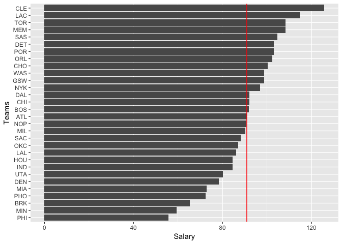
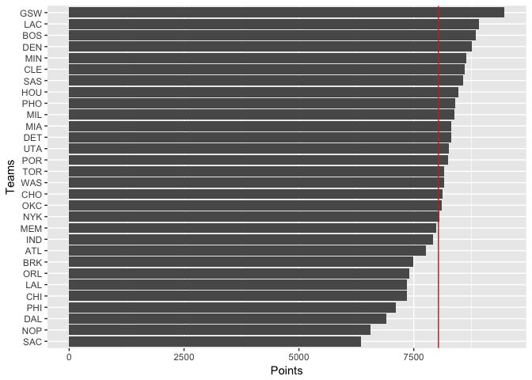
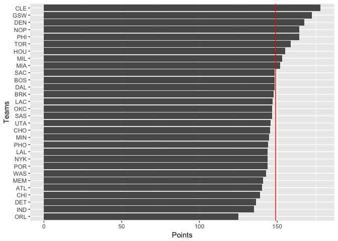
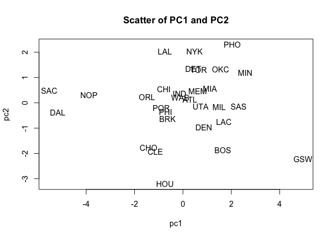
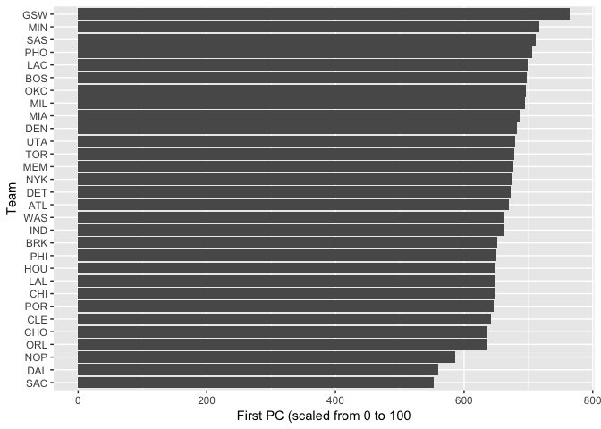

HW03
================

R Markdown
----------

``` r
gg_salary <- ggplot(data = teams, aes(x =reorder(team, salary) ,y =salary, group = 1)) + labs(x= "Teams", y = "Salary") +
  geom_bar(stat='identity') + coord_flip() 
gg_salary <- gg_salary + geom_hline(yintercept = mean(teams$salary),color = "red")
gg_salary
```



``` r
gg_points <- ggplot(data = teams, aes(x =reorder(team, points) ,y =points, group = 1)) + labs(x= "Teams", y = "Points") +
  geom_bar(stat='identity') + coord_flip() 
gg_points <- gg_points + geom_hline(yintercept = mean(teams$points),color = "red")
gg_points
```



``` r
gg_eff <- ggplot(data = teams, aes(x =reorder(team, efficiency) ,y =efficiency, group = 1)) + labs(x= "Teams", y = "Points") +
  geom_bar(stat='identity') + coord_flip() 
gg_eff <- gg_eff + geom_hline(yintercept = mean(teams$efficiency),color = "red")
gg_eff
```



``` r
pcateam <- select(teams, points3, points2, free_throws, off_rebounds, def_rebounds, assists, steals, blocks, turnovers, fouls)

pca <- prcomp(pcateam, scale.=TRUE)
pca
```

    ## Standard deviations:
    ##  [1] 2.1669994 1.3046111 0.9897094 0.8784756 0.7308134 0.6913872 0.6182263
    ##  [8] 0.5101592 0.3655034 0.2503921
    ## 
    ## Rotation:
    ##                    PC1         PC2         PC3          PC4         PC5
    ## points3      0.1121782 -0.65652993  0.28806873 -0.042637313  0.28657624
    ## points2      0.3601766  0.32892544 -0.06763180 -0.347710703 -0.15173866
    ## free_throws  0.3227564 -0.17651228  0.39157491  0.147596178 -0.21363792
    ## off_rebounds 0.3029366  0.35931603  0.33884845 -0.288483019 -0.16571824
    ## def_rebounds 0.3719432 -0.12808273  0.15026131 -0.492969442  0.26476256
    ## assists      0.3125312 -0.44134618 -0.26294129 -0.088066602 -0.36972525
    ## steals       0.3447256 -0.03540585 -0.48554101  0.177578661 -0.33549491
    ## blocks       0.3162237  0.06131890 -0.48869371  0.003935374  0.65459381
    ## turnovers    0.3353958 -0.02169833  0.08910421  0.532117541 -0.04471763
    ## fouls        0.3072548  0.28954426  0.26469871  0.454751471  0.26814214
    ##                       PC6         PC7         PC8         PC9         PC10
    ## points3      -0.028435666  0.38167878  0.18027569 -0.20631322  0.409762462
    ## points2      -0.088714347  0.07302430 -0.47216199 -0.35836740  0.499011524
    ## free_throws  -0.487342521 -0.62732220  0.07726675 -0.08283563 -0.006875686
    ## off_rebounds  0.283093235  0.13535335  0.64646479 -0.14735551 -0.124601143
    ## def_rebounds  0.066309015 -0.04926346 -0.23787252  0.64632050 -0.168579984
    ## assists       0.176019008  0.11785039 -0.18235775 -0.34086739 -0.547385461
    ## steals       -0.303664534  0.25883825  0.32703573  0.41596580  0.246739300
    ## blocks       -0.009954065 -0.30799231  0.23947533 -0.27071160 -0.057627209
    ## turnovers     0.675777660 -0.18850849 -0.14308362  0.13524769  0.250947823
    ## fouls        -0.298848473  0.47268121 -0.21462859 -0.04367200 -0.335087245

``` r
eigenvalue = pca$sdev^2
prop = round(pca$sdev^2 / sum(pca$sdev^2), 4)
cprop = cumsum(prop)
eigs <- data.frame(
  eigenvalue,
  prop,
  cprop
)
eigs
```

    ##    eigenvalue   prop  cprop
    ## 1  4.69588631 0.4696 0.4696
    ## 2  1.70201009 0.1702 0.6398
    ## 3  0.97952464 0.0980 0.7378
    ## 4  0.77171938 0.0772 0.8150
    ## 5  0.53408824 0.0534 0.8684
    ## 6  0.47801622 0.0478 0.9162
    ## 7  0.38220374 0.0382 0.9544
    ## 8  0.26026243 0.0260 0.9804
    ## 9  0.13359274 0.0134 0.9938
    ## 10 0.06269622 0.0063 1.0001

``` r
pc1 <- pca$x[,1] 
pc2 <- pca$x[,2] 
plot(pc1, pc2, main = "Scatter of PC1 and PC2", cex = 0)
text(pc1,pc2,labels=teams$team)
```



``` r
s1 <- 100 * ((pc1 - min(pc1))/ max(pc1) - min(pc1))
gg_pc1 <- ggplot(data = teams, aes(x =reorder(teams$team, s1) ,y =s1, group = 1)) + labs(x= "Team", y = "First PC (scaled from 0 to 100") +
  geom_bar(stat='identity') + coord_flip() 
gg_pc1
```



Comments and Reflections:

Whas this your firt time working on a project with such file structure? Yes, it was interested, but seems like too much work Was this your first time using rel paths? NO Was this your first time using an R script? NO What things were hard? Understanding PCA What was easy ish? The R script part Did anyone help you? No How much time did it take to complete this hw? About 3 hours What was the most time consuming? PCA part Anything interesting? The plots
