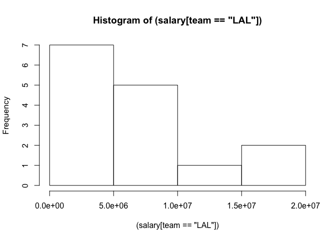
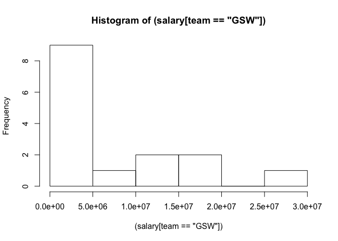
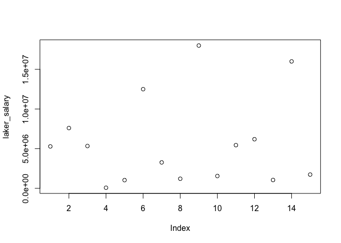
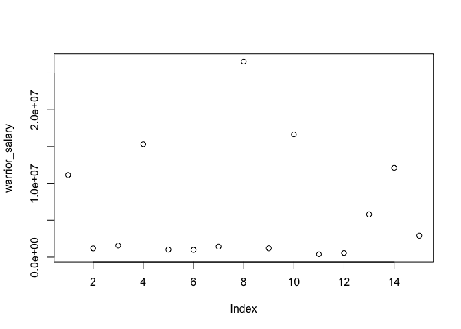
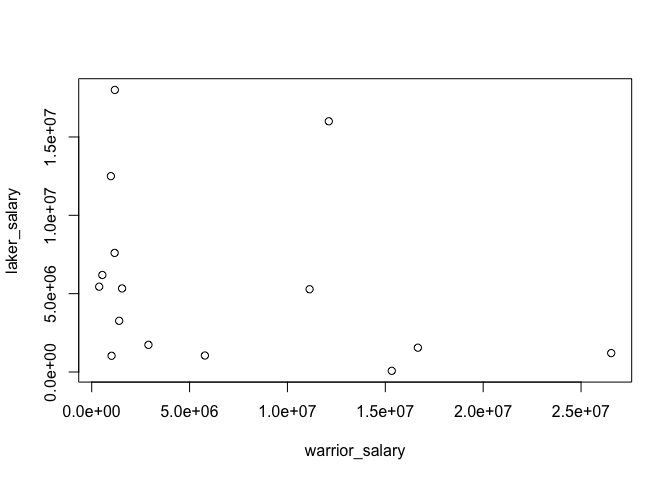
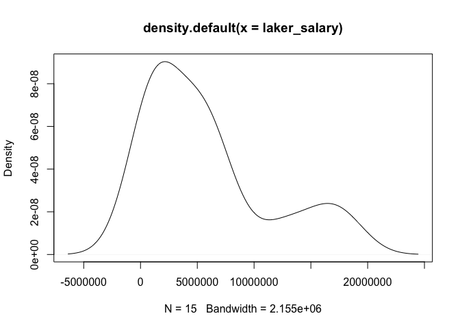
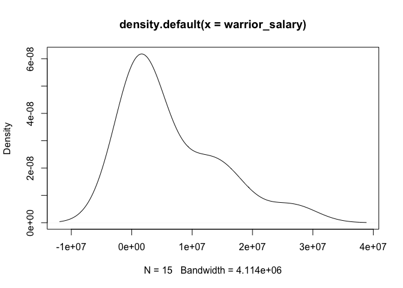
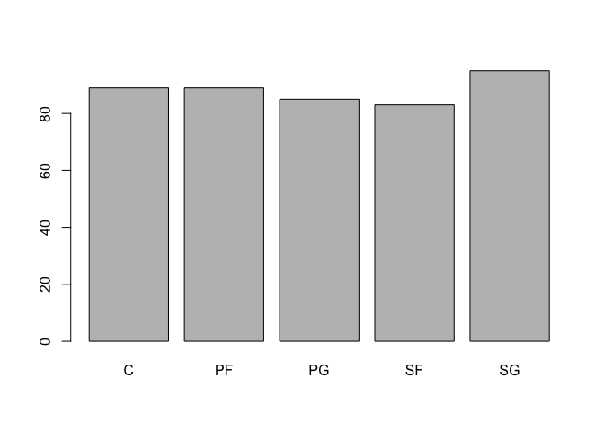

hw02
================

Quantitative Variable : Salary - Lakers vs Warriors
===================================================

``` r
#### Summary of Salary
summary(salary)
```

    ##     Min.  1st Qu.   Median     Mean  3rd Qu.     Max. 
    ##     5145  1286000  3500000  6187000  9250000 30960000

``` r
#### Summary of Lakers
summary(salary[team == 'LAL'])
```

    ##     Min.  1st Qu.   Median     Mean  3rd Qu.     Max. 
    ##    73530  1380000  5282000  5751000  6896000 18000000

``` r
#### Summary of Warriors
summary(salary[team == 'GSW'])
```

    ##     Min.  1st Qu.   Median     Mean  3rd Qu.     Max. 
    ##   383400  1094000  1552000  6579000 11620000 26540000

``` r
#### Mean Salary of Lakers
mean((salary[team == 'LAL']))
```

    ## [1] 5751279

``` r
#### Mean Salary of Warriors
mean((salary[team == 'GSW']))
```

    ## [1] 6579394

``` r
#### Standard Deviation of Lakers
sd((salary[team == 'LAL']))
```

    ## [1] 5618077

``` r
#### Standard Deviation of Warriors
sd((salary[team == 'GSW']))
```

    ## [1] 7972201

``` r
#### Minimum Salary for Lakers
min((salary[team == 'LAL']))
```

    ## [1] 73528

``` r
#### Minimum Salary for Warriors
min((salary[team == 'GSW']))
```

    ## [1] 383351

``` r
#### Max Salary for Lakers
max((salary[team == 'LAL']))
```

    ## [1] 1.8e+07

``` r
format(max((salary[team == 'LAL'])),scientific=FALSE)
```

    ## [1] "18000000"

``` r
#### Max Salary for Warriors
max((salary[team == 'GSW']))
```

    ## [1] 26540100

``` r
#### Median for Lakers
median((salary[team == 'LAL']))
```

    ## [1] 5281680

``` r
#### Median for Warriors
median((salary[team == 'GSW']))
```

    ## [1] 1551659

``` r
#### Quartiles for Lakers
quantile((salary[team == 'LAL']))
```

    ##       0%      25%      50%      75%     100% 
    ##    73528  1379670  5281680  6895500 18000000

``` r
#### Quartiles for Warriors
quantile((salary[team == 'GSW']))
```

    ##       0%      25%      50%      75%     100% 
    ##   383351  1093628  1551659 11621864 26540100

``` r
mode <- function(x) {
  ux <- unique(x)
  ux[which.max(tabulate(match(x, ux)))]
}

#### Typical Value for Lakers
mode((salary[team == 'LAL']))
```

    ## [1] 5281680

``` r
#### Typical Value for Warriors
mode((salary[team == 'GSW']))
```

    ## [1] 11131368

``` r
#### Histogram for Lakers
hist((salary[team == 'LAL']))
```



``` r
#### Histogram for Warriors
hist((salary[team == 'GSW']))
```



``` r
#### Plot for Lakers
laker_salary <- (salary[team == 'LAL'])
laker_player <- (player[team == 'LAL'])
plot(laker_salary)
```



``` r
#### Plot for Warrior
warrior_salary <- (salary[team == 'GSW'])
warrior_player <- (player[team == 'GSW'])
plot(warrior_salary)
```



``` r
#### Both Salaries Combined
plot(warrior_salary, laker_salary)
```



``` r
#### Density Curve for Lakers 
d_lakers <- density(laker_salary)
plot(d_lakers)
```



``` r
#### Density Curve for Warriors
d_warriors <- density(warrior_salary)
plot(d_warriors)
```



### Observations for Quantitative Variable

Both of the plots demonstrate to be skewed right with large spreads. The centers are both towards the less than the middle salary, indicating that most players earn a lot less than the "stars" of the team. The stars of the teams are the outliers, earning far much more than the rest of the team. The Lakers salary ranges from $73528 t0 $18000000 while Warriors salary ranges from $383351 to $26540100. The mean for the Lakers is $6579394 while for the Warriors is $5751279. By inspection of the density graph for both teams, there is a big gap between those who earn less, who earn around the mean, and the superstars, but that is what is expected with salary caps and team sports. Given the Warriors success of recent years and management, it is also expected for their salaries to be higher. Another factor is the super team that is the current warriors, with more stars in the teams, the more money to be paid but the less of the star players suffer because there needs to be a salary balance or a salary cap. This dynamic also gives further insight for the density graphs and explains why they are skewed right, there needs to be a balance and more of lower salaries than higher ones to follow the salary cap. There is a more balance right skew from the Warriors Team than the Lakers team. There are more higher Laker salaries but there is a big difference between Warriors highest salary and the highest Laker salary (the Warriors having the highest salary). This allows for the salaries above the mean to be higher than the the Warriors salary since that difference is allocated to more players.

Qualitative Variable : Position
===============================

``` r
### Frequency Table (Counts)
table(position)
```

    ## position
    ##  C PF PG SF SG 
    ## 89 89 85 83 95

``` r
### Relative Frequencies (Proportions)
prop.table(table(position))
```

    ## position
    ##         C        PF        PG        SF        SG 
    ## 0.2018141 0.2018141 0.1927438 0.1882086 0.2154195

``` r
### plot for frequencies 
barplot(table(position))
```



``` r
### plot for relative frequencies
barplot(prop.table(table(position)))
```


    ### Description of overall distribution

    Use the frequencies (counts) and relative frequencies (proportions) to describe the overall distribution.

    Given the counts, the position with the most players in the league at 95 is SF. The position with the least players in the league is SF at 83. The mode is at 89, for PF and C.For the proportions this translate to .215 for SG at the position with most players, .188 for SF as the position with less players. And .2018 for SF and C as the mode. The mean for the positions is 89. By dividing the mean with the total number of teams in the league (30), we get that there are 2.96667 players per position. Without getting into detail of the roles of these positions and determining why there is more of one position than the other, it is clear that and logically that teams have a balanced roster, with around 3 players per position, where if there is a third player for that position, they do not see a lot of playing time but serve to give rotation to the other two main players. It would be unreasonable for there to be more Centers in the league than Point Guards when they are both in the court at the same time and they are equally important. To have more Centers than Point Guards in a team would mean you would have 1, maybe two points guards and teams will not be able to rotate and give their players a break during a game. With my limited basketball knowledge, although there are vairous contributing factors as to why there isn't an equal amount of players in each position, a main contributor is with a teams style of play or if they have a super star in one position they will likely play them for most of the match and do not require more than 1 player as their backup.


    ### Report of Process

    1. What things were hard, even though you saw them in class?
        Trying to make things look nice seems to be hard (although I didn't includ any in my final report).
    2. What was easy(-ish) even though we haven't done it in class?
        Everything was straight forward
    3. What type of "errors" you struggled with (if any)?
        No errors
    4. What are the parts you are not fully understanding?
        A lot of the statistics terminologs.
    5. What was the most time consuming part?
        The whole process as a whole is time consuming
    6. Did you collaborate with other students? If so, with who? In what manner?
        I did not
    7. Was there any frustrating issue? (e.g. RStudio cryptic error, one or more package not playing nice)
        Not at all
